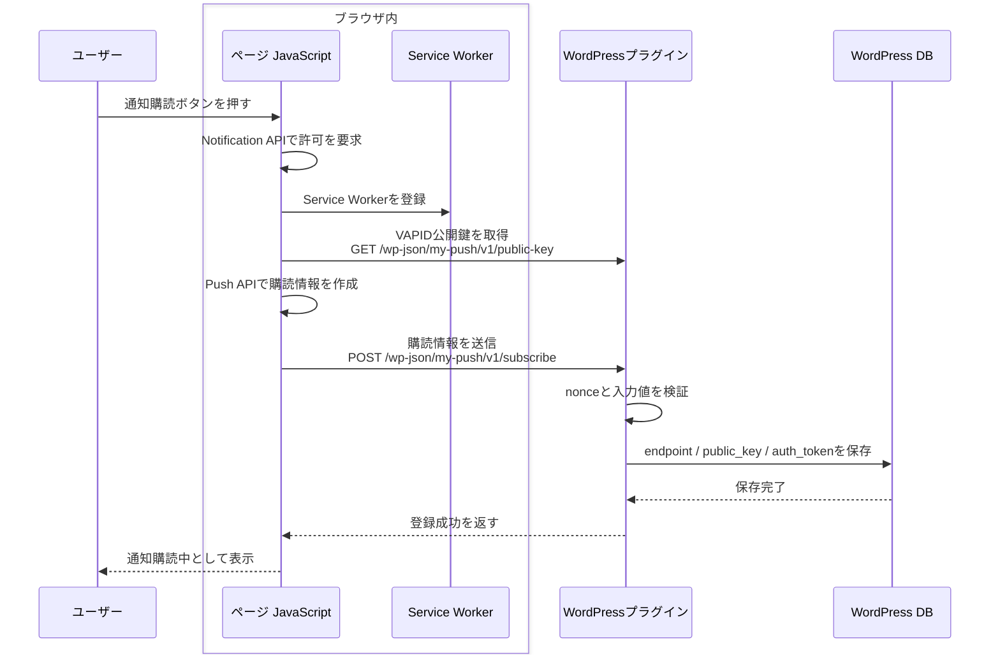
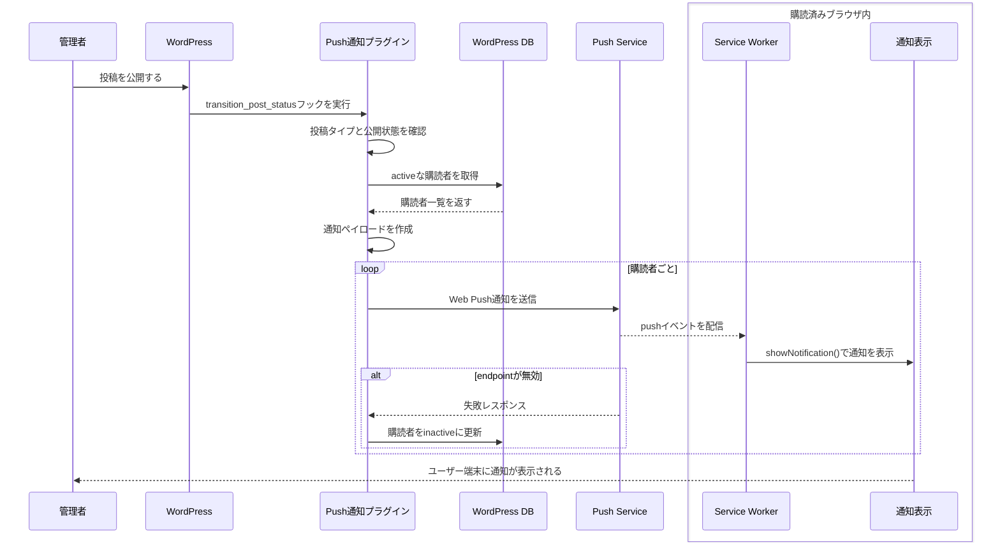

# Push 通知プラグイン仕様書

この仕様書は、WordPress に Push 通知機能を追加するカスタムプラグインの初期仕様をまとめたものです。

初期実装では、通常ブラウザ向けの Web Push 通知を中心に作成します。Flutter アプリの WebView から表示する場合は、Web Push がそのまま動かない環境があるため、後続フェーズでネイティブ Push 通知との連携を追加できる構成にします。

## 目的

`my-push-notification-plugin` は、WordPress の投稿公開や管理画面からの手動操作をきっかけに、購読済みユーザーへ Push 通知を送るためのプラグインです。

初期実装では、次のことを目的にします。

- WordPress 管理画面の「プラグイン」から有効化できること
- フロント画面で通知購読ボタンを表示できること
- ユーザーがブラウザ通知を許可した場合、購読情報を WordPress に保存できること
- 新規投稿公開時に、購読者へ通知を送信できること
- 管理画面からテスト通知を送信できること
- セキュリティ対策として nonce、権限チェック、入力検証、エスケープを行うこと
- Flutter WebView 連携を後から追加しやすい設計にすること

## プラグイン名

- ディレクトリ名: `my-push-notification-plugin`
- メインファイル: `my-push-notification-plugin.php`
- テキストドメイン: `my-push-notification-plugin`
- 管理画面表示名: `My Push Notification Plugin`

## ディレクトリ構成

```text
wordpress_data/wp-content/plugins/my-push-notification-plugin/
├── my-push-notification-plugin.php
├── composer.json
├── composer.lock
├── includes/
│   ├── class-plugin.php
│   ├── class-admin.php
│   ├── class-rest.php
│   ├── class-subscriber-repository.php
│   └── class-web-push-service.php
├── assets/
│   ├── css/
│   │   └── push.css
│   └── js/
│       ├── subscribe.js
│       └── service-worker.js
├── vendor/
│   └── ...
└── uninstall.php
```

## 機能範囲

### 初期実装で作る機能

- プラグイン有効化時に購読者保存用テーブルを作成する
- 管理画面に設定ページを追加する
- VAPID 公開鍵、秘密鍵、通知タイトルの初期値を保存できるようにする
- 管理画面から VAPID 鍵を生成できるようにする
- フロント画面に通知購読ボタンを表示する
- Service Worker を登録する
- REST API で購読情報を登録、解除できるようにする
- 投稿が新規公開されたタイミングで Push 通知を送信する
- 管理画面からテスト通知を送信する

### 初期実装では作らない機能

- 通知履歴画面
- ユーザーごとの詳細なセグメント配信
- カスタム投稿タイプごとの通知 ON/OFF
- Flutter ネイティブ Push 通知の本実装
- Firebase Cloud Messaging 連携
- 多言語翻訳ファイル

## 用語

### nonce

正式名称:

```text
number used once
```

`nonce` は、WordPress がフォーム送信、REST API、Ajax などの操作元を確認するために使う検証用トークンです。

このプラグインでは、通知購読登録や購読解除のリクエストが、正しく WordPress 側で生成された画面やスクリプトから送られたものかを確認するために使います。

主な目的:

- 外部サイトから勝手に購読登録 API を呼ばれることを防ぐ
- 管理画面の設定保存やテスト通知送信を保護する
- REST API への意図しないリクエストを減らす

WordPress の nonce は、厳密な意味での完全な使い捨て値ではなく、一定時間有効な操作確認トークンです。

実装で使う主な関数:

```php
wp_create_nonce()
wp_verify_nonce()
check_admin_referer()
```

### VAPID

正式名称:

```text
Voluntary Application Server Identification
```

`VAPID` は、Web Push 通知を送信するアプリケーションサーバーを識別するための仕組みです。

このプラグインでは、WordPress が Push Service に通知を送るときに、「この WordPress サイトが正しい送信者である」ことを示すために使います。

VAPID では、公開鍵と秘密鍵を使います。

| 鍵 | 使う場所 | 内容 |
| -- | -------- | ---- |
| 公開鍵 | ブラウザ側 | Push 購読情報を作成するときに使う |
| 秘密鍵 | WordPress 側 | Push 通知送信時の署名に使う |

秘密鍵は外部に公開してはいけません。管理画面でも、保存済みかどうかだけを表示し、値そのものは常時表示しない方針にします。

### Push Service

`Push Service` は、ブラウザそのものではなく、ブラウザベンダー側が用意している通知配信用の中継サーバーです。

WordPress プラグインはユーザーのブラウザへ直接通知を送るのではなく、購読情報に含まれる `endpoint` に対して通知を送ります。この `endpoint` は、ブラウザが Push Service から取得した送信先 URL です。

関係:

```text
WordPress プラグイン
  ↓ 通知を送る
Push Service
  ↓ 配信する
ユーザーのブラウザ
  ↓ 表示する
通知
```

ブラウザごとの Push Service の例:

| ブラウザ | Push Service の例 |
| -------- | ----------------- |
| Chrome / Edge | Google 系の Push Service |
| Firefox | Mozilla 系の Push Service |
| Safari | Apple 系の Push Service |

このプラグインでは、Push Service の種類を直接指定しません。ブラウザが作成した購読情報の `endpoint` に送信することで、結果的に対象ブラウザの Push Service へ通知が送られます。

Flutter アプリの Push 通知で使う Firebase Cloud Messaging や Apple Push Notification service も、役割としては Push Service に近いものです。ただし Web Push とは仕組みが異なるため、Flutter WebView 向けのネイティブ Push 通知は後続タスクで扱います。

## Web Push の前提

Web Push 通知には、ブラウザ内の機能、外部の Push Service、WordPress 側の送信処理が必要です。

| 分類 | 要素 | 役割 |
| ---- | ---- | ---- |
| 実行環境 | HTTPS 環境、またはローカル開発時の `localhost` | Service Worker と Push API を安全に使うための前提 |
| ブラウザ内の Web API | Notification API | 通知の許可を取得し、通知を表示する |
| ブラウザ内の Web API | Push API | Push Service への購読を作成し、`endpoint` などの購読情報を取得する |
| ブラウザ内の仕組み | Service Worker | ページを閉じていても `push` イベントを受け取り、通知表示を行う |
| 外部サービス | Push Service | WordPress から送られた通知を、対象ブラウザへ中継する |
| 送信者証明 | VAPID 鍵 | WordPress が正しい通知送信者であることを Push Service に示す |
| WordPress 側 | Push 送信用 PHP ライブラリ | 購読情報と VAPID 鍵を使って Web Push 通知を送信する |

PHP 側の Web Push 送信には、次の Composer パッケージの利用を想定します。

```text
minishlink/web-push
```

ローカル開発では `http://localhost:8080` を使うため、ブラウザによっては通知許可と Service Worker が動作します。本番環境では HTTPS が必須です。

## シーケンス図

### 通知購読登録



### 投稿公開時の通知送信



## Flutter WebView での扱い

Flutter アプリの WebView では、通常ブラウザと同じ Web Push が使えない場合があります。

初期実装では、WebView 内でもページ表示が壊れないようにしつつ、Push 通知そのものは通常ブラウザ向け Web Push として実装します。

WebView へ直接通知を飛ばす仕組みは初回実装には含めず、後続タスクとして扱います。後続フェーズでは、次のどちらかを追加します。

| 方式 | 内容 | 向いている用途 |
| ---- | ---- | -------------- |
| WebView JavaScript Bridge | WebView から Flutter 側へ通知購読要求を渡す | 既存 Flutter アプリに組み込む場合 |
| Firebase Cloud Messaging | Flutter 側で FCM トークンを取得し、WordPress に保存する | iOS / Android の安定した Push 通知 |

将来的に FCM に対応する場合も、WordPress 側では「購読者」「通知送信」「投稿公開フック」を共通化し、送信方式だけを差し替えられる構成にします。

## データベース

購読情報は WordPress の独自テーブルに保存します。

テーブル名:

```text
{$wpdb->prefix}my_push_subscribers
```

カラム:

| カラム | 型 | 内容 |
| ------ | -- | ---- |
| `id` | BIGINT UNSIGNED | 主キー |
| `endpoint_hash` | CHAR(64) | endpoint の SHA-256 ハッシュ。重複防止用 |
| `endpoint` | TEXT | Push API の endpoint |
| `public_key` | TEXT | 購読者の公開鍵 |
| `auth_token` | TEXT | 購読者の auth token |
| `user_id` | BIGINT UNSIGNED NULL | ログインユーザーの場合のユーザー ID |
| `user_agent` | TEXT NULL | ブラウザ識別用 |
| `status` | VARCHAR(20) | `active` / `inactive` |
| `created_at` | DATETIME | 作成日時 |
| `updated_at` | DATETIME | 更新日時 |

`endpoint` は重複しないように扱います。同じ endpoint が再登録された場合は、既存レコードを更新します。

## 設定項目

管理画面に `設定 > Push 通知` を追加します。

設定項目:

| 項目 | option 名 | 内容 |
| ---- | --------- | ---- |
| VAPID 公開鍵 | `my_push_vapid_public_key` | ブラウザへ渡す公開鍵 |
| VAPID 秘密鍵 | `my_push_vapid_private_key` | サーバー側で使う秘密鍵 |
| VAPID subject | `my_push_vapid_subject` | `mailto:` またはサイト URL |
| 通知タイトル | `my_push_default_title` | 投稿通知の標準タイトル |
| 自動通知 | `my_push_auto_notify_posts` | 投稿公開時に自動送信するか |

秘密鍵は管理画面上で常に表示しません。保存済みの場合は「設定済み」と表示します。

## REST API

REST API namespace:

```text
my-push/v1
```

エンドポイント:

| メソッド | パス | 用途 |
| -------- | ---- | ---- |
| `POST` | `/subscribe` | 購読情報を保存する |
| `POST` | `/unsubscribe` | 購読情報を無効化する |
| `GET` | `/public-key` | VAPID 公開鍵を返す |

セキュリティ:

- フロントからの登録には WordPress nonce を使う
- REST API の入力値を検証する
- endpoint、keys、auth の形式を確認する
- 保存前に `wp_unslash()` と `sanitize_text_field()` などを適切に使う
- JSON 出力は `WP_REST_Response` で返す

## フロント表示

初期実装では、投稿一覧や投稿詳細の下部に通知購読ボタンを表示します。

表示例:

```text
更新通知を受け取る
```

状態:

| 状態 | 表示 |
| ---- | ---- |
| 未対応ブラウザ | ボタンを非表示、または無効化 |
| 未許可 | `更新通知を受け取る` |
| 許可済み | `通知を購読中` |
| 拒否済み | `ブラウザ設定で通知が拒否されています` |

CSS はプラグイン側に最小限だけ持たせます。テーマの見た目を壊さないよう、ボタンは控えめなスタイルにします。

## 投稿公開時の通知

投稿が新規公開されたときに通知を送ります。

利用するフック:

```php
transition_post_status
```

送信条件:

- 新しいステータスが `publish`
- 古いステータスが `publish` ではない
- 投稿タイプが `post`
- 自動通知設定が有効

通知内容:

| 項目 | 内容 |
| ---- | ---- |
| title | 設定された通知タイトル、またはサイト名 |
| body | 投稿タイトル |
| url | 投稿の permalink |
| icon | サイトアイコンがあれば使用 |

## 管理画面

管理画面では次の操作をできるようにします。

- VAPID 鍵の設定
- VAPID 鍵の生成
- 自動通知の ON/OFF
- 購読者数の確認
- テスト通知の送信

管理画面の権限:

```text
manage_options
```

設定保存には `settings_fields()`、`register_setting()`、`check_admin_referer()` を使います。

## セキュリティ方針

実装時は次を必ず行います。

- PHP ファイル冒頭で `ABSPATH` チェックを行う
- 管理画面は `current_user_can( 'manage_options' )` で保護する
- 設定保存に nonce を使う
- REST API の入力値を検証する
- DB 操作には `$wpdb->prepare()` を使う
- 出力時は `esc_html()`、`esc_attr()`、`esc_url()` を使う
- Service Worker へ渡す値は `wp_json_encode()` で出力する
- 送信失敗した購読 endpoint は inactive にする

## テスト計画

### PHP

- メインプラグインファイルが PHP 構文エラーなく読み込めること
- 管理画面に設定ページが表示されること
- プラグイン有効化時に購読者テーブルが作成されること
- REST API の `/public-key` が公開鍵を返すこと
- `/subscribe` が正しい購読情報を保存すること
- `/unsubscribe` が購読情報を無効化すること
- 投稿公開時に通知送信処理が呼ばれること

### ブラウザ

- `http://localhost:8080` でボタンが表示されること
- 通知未対応ブラウザでエラー表示にならないこと
- 通知許可後に Service Worker が登録されること
- 購読情報が REST API 経由で保存されること
- テスト通知が受信できること

### レスポンシブ

- スマホ幅で購読ボタンが横にはみ出さないこと
- Flutter WebView 想定の 375px、390px、430px 幅で横スクロールしないこと
- 通知未対応の場合でもページ表示が崩れないこと

## 実装ステップ

1. プラグイン最小構成を作る
2. 有効化フックで DB テーブルを作成する
3. 管理画面の設定ページを作る
4. VAPID 鍵を保存できるようにする
5. REST API を追加する
6. Service Worker と購読 JS を追加する
7. フロントに購読ボタンを表示する
8. 投稿公開時の自動通知を追加する
9. 管理画面のテスト通知を追加する
10. スマホ幅と WebView 想定幅で表示確認する

## 将来追加したい機能

- FCM トークン保存
- Flutter アプリ向け通知 API
- 通知履歴
- 投稿ごとの通知送信 ON/OFF
- カテゴリー別購読
- カスタム投稿タイプ対応
- WooCommerce や会員サイトとの連携
- 通知クリック数の計測
