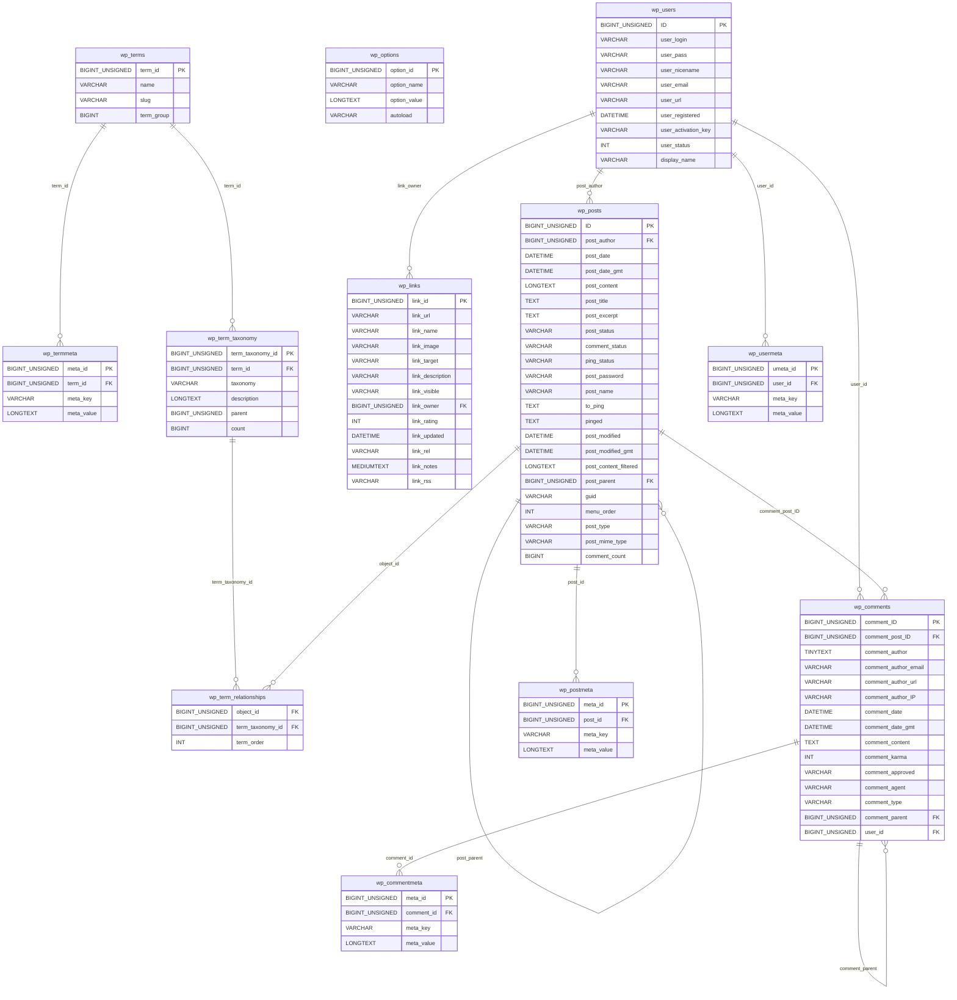
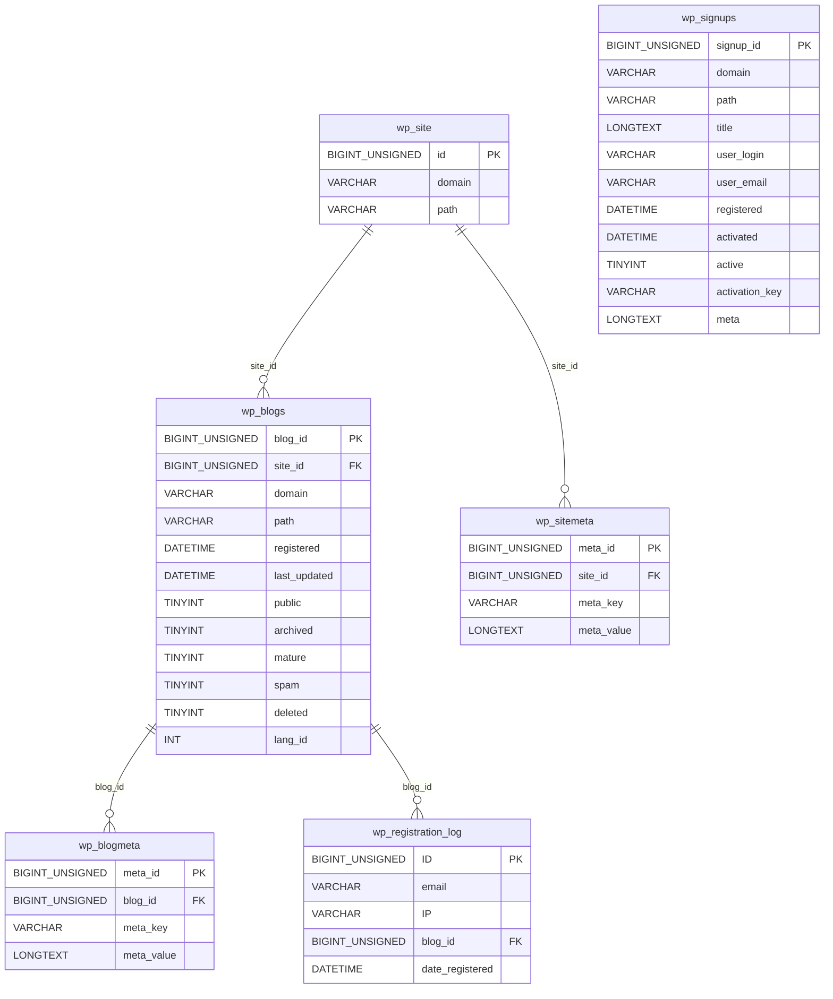
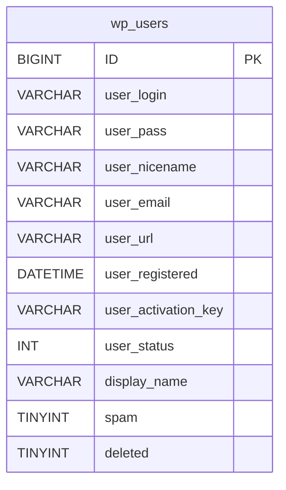
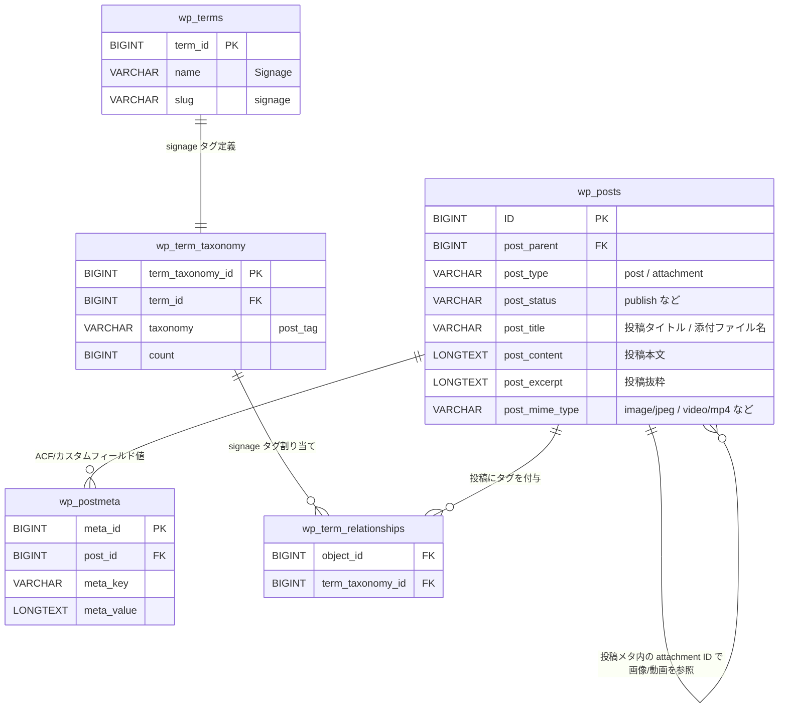
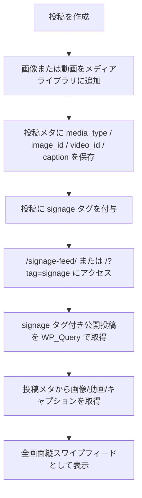

# Signage Swipe Feed ER 図

このドキュメントは、サイネージ向け縦スワイプフィード機能で利用する WordPress 標準テーブルと、そこに保存されるデータの関係を示します。

この機能では独自テーブルは作成しません。通常投稿、投稿メタ、タグ、メディアライブラリの標準構造を利用します。

## WordPress 標準テーブル全体

以下は WordPress コアの `wp-admin/includes/schema.php` に定義されている標準テーブルです。

接頭辞 `wp_` はデフォルト値です。実環境では `wp-config.php` の `$table_prefix` によって変わります。

### 単一サイトで作成される標準テーブル

単一サイト構成で通常作成される標準テーブルは以下の 12 個です。カラムは省略せず、WordPress コアのスキーマ定義に沿って記載しています。

### マルチサイト有効時に追加される標準テーブル

マルチサイトを有効化すると、ネットワーク全体を管理するために以下のテーブルが追加されます。単一サイトでは通常作成されません。

### 参考: マルチサイト有効時の `wp_users`

マルチサイト構成では、`wp_users` に `spam` と `deleted` が追加されます。

## サイネージ機能に関係する部分

## 保存されるデータ

### `wp_posts`

通常投稿とメディアライブラリ上の画像/動画が入ります。

`wp_posts` は名前に `posts` とありますが、通常投稿だけでなく固定ページ、メディア、リビジョン、サイトエディター関連データなども保存する共通テーブルです。どの種類のデータかは `post_type` で判定します。

以下は WordPress コアが標準で登録する主な組み込み `post_type` です。プラグインやテーマは `register_post_type()` によって、これらとは別に独自のカスタム投稿タイプを追加できます。

| `post_type` | WordPress 上の意味 | 主な保存内容 |
| --- | --- | --- |
| `post` | 投稿 | ブログ記事・ニュース記事など、時系列で扱う通常投稿です。 |
| `page` | 固定ページ | 会社概要、問い合わせ、利用規約など、階層構造を持てる固定コンテンツです。 |
| `attachment` | 添付ファイル | メディアライブラリにアップロードされた画像、動画、PDF などです。ファイル実体へのパスやメタデータは `wp_postmeta` にも保存されます。アップロード経路によっては `post_parent` に関連元投稿 ID が入ります。 |
| `revision` | リビジョン | 投稿、固定ページ、テンプレートなどの編集履歴です。通常は `post_parent` に元投稿 ID が入ります。 |
| `nav_menu_item` | クラシックメニュー項目 | 外観 > メニューで作成されるメニュー項目です。 |
| `custom_css` | 追加 CSS | カスタマイザーの追加 CSS です。 |
| `customize_changeset` | カスタマイザー変更セット | カスタマイザーでの未公開/予約/保存済み変更内容です。 |
| `oembed_cache` | oEmbed キャッシュ | 埋め込み URL の oEmbed レスポンスキャッシュです。 |
| `user_request` | ユーザー個人データリクエスト | 個人データのエクスポート/削除など、プライバシー機能のリクエストです。 |
| `wp_block` | パターン | ブロックパターンなど、ブロックエディターで再利用されるブロックコンテンツです。 |
| `wp_template` | ブロックテーマのテンプレート | サイトエディターで編集されるテンプレートです。 |
| `wp_template_part` | ブロックテーマのテンプレートパーツ | ヘッダー、フッターなど、テンプレート内で使うパーツです。 |
| `wp_global_styles` | グローバルスタイル | ブロックテーマのサイト全体スタイル設定です。 |
| `wp_navigation` | ナビゲーション | ブロックテーマ/サイトエディターで使うナビゲーションメニューです。 |
| `wp_font_family` | フォントファミリー | フォントライブラリで管理するフォントファミリー情報です。 |
| `wp_font_face` | フォントフェイス | フォントファミリーに紐づく個別フォントファイル/スタイル情報です。 |

| データ | `post_type` | 説明 |
| --- | --- | --- |
| サイネージ対象の記事 | `post` | `signage` タグを付けることで縦スワイプフィードに表示されます。 |
| 画像 | `attachment` | メディアライブラリにアップロードされた画像です。 |
| 動画 | `attachment` | メディアライブラリにアップロードされた動画です。 |

`post_parent` は、`wp_posts` 内の別レコードを親として参照するカラムです。代表的には、リビジョンが元投稿を指す場合や、添付ファイルがアップロード時の関連投稿を指す場合に使われます。ただし、メディアライブラリ上の添付ファイルは必ず `post_parent` で投稿に紐づくとは限らないため、このサイネージ機能では `wp_postmeta` の `ssf_image_id` / `ssf_video_id` で使用メディアを明示的に参照します。

### `wp_postmeta`

投稿ごとの追加情報が入ります。ACF が有効な場合も、入力値は基本的にこのテーブルに保存されます。

| `meta_key` | `meta_value` | 説明 |
| --- | --- | --- |
| `ssf_media_type` | `image` または `video` | ACF 利用時のメディア種別です。 |
| `ssf_image_id` | 画像 attachment ID | ACF 利用時の画像 ID です。 |
| `ssf_video_id` | 動画 attachment ID | ACF 利用時の動画 ID です。 |
| `ssf_caption` | キャプション文字列 | ACF 利用時の左下表示キャプションです。 |
| `_ssf_media_type` | `image` または `video` | ACF 未導入時のフォールバック用メディア種別です。 |
| `_ssf_image_id` | 画像 attachment ID | ACF 未導入時のフォールバック用画像 ID です。 |
| `_ssf_video_id` | 動画 attachment ID | ACF 未導入時のフォールバック用動画 ID です。 |
| `_ssf_caption` | キャプション文字列 | ACF 未導入時のフォールバック用キャプションです。 |

### `wp_terms` / `wp_term_taxonomy` / `wp_term_relationships`

`signage` タグと、投稿へのタグ付け状態が入ります。

| テーブル | 保存内容 |
| --- | --- |
| `wp_terms` | `name = Signage`, `slug = signage` のタグ名情報 |
| `wp_term_taxonomy` | その term が `post_tag` であるという分類情報 |
| `wp_term_relationships` | どの投稿に `signage` タグが付いているかの紐づけ |

## 実データのパターン例

ここでは、実際に WordPress の標準テーブルへどのようなレコードが入るかを示します。ID や日時は例です。

横に長い表だと `wp_posts` の全カラムを追いづらいため、`wp_posts` は 1 レコードごとに「カラム / 値」の縦表で記載します。`wp_postmeta` やタグ関連テーブルも、対象テーブルの全カラムを記載します。

### パターン 1: 画像 1 枚を表示するサイネージ投稿

サイネージ対象の記事として通常投稿を作り、メディアライブラリ上の画像を 1 枚選択するパターンです。

#### `wp_posts`: 投稿本体 `ID = 101`

| カラム | 値 |
| --- | --- |
| `ID` | `101` |
| `post_author` | `1` |
| `post_date` | `2026-04-10 09:00:00` |
| `post_date_gmt` | `2026-04-10 00:00:00` |
| `post_content` | `設備点検のため休館します。` |
| `post_title` | `休館のお知らせ` |
| `post_excerpt` | `4月15日は休館です。` |
| `post_status` | `publish` |
| `comment_status` | `open` |
| `ping_status` | `open` |
| `post_password` |  |
| `post_name` | `closed-notice` |
| `to_ping` |  |
| `pinged` |  |
| `post_modified` | `2026-04-10 09:00:00` |
| `post_modified_gmt` | `2026-04-10 00:00:00` |
| `post_content_filtered` |  |
| `post_parent` | `0` |
| `guid` | `http://example.local/?p=101` |
| `menu_order` | `0` |
| `post_type` | `post` |
| `post_mime_type` |  |
| `comment_count` | `0` |

#### `wp_posts`: 画像 attachment `ID = 501`

| カラム | 値 |
| --- | --- |
| `ID` | `501` |
| `post_author` | `1` |
| `post_date` | `2026-04-10 09:05:00` |
| `post_date_gmt` | `2026-04-10 00:05:00` |
| `post_content` |  |
| `post_title` | `closed-notice.jpg` |
| `post_excerpt` |  |
| `post_status` | `inherit` |
| `comment_status` | `open` |
| `ping_status` | `closed` |
| `post_password` |  |
| `post_name` | `closed-notice-jpg` |
| `to_ping` |  |
| `pinged` |  |
| `post_modified` | `2026-04-10 09:05:00` |
| `post_modified_gmt` | `2026-04-10 00:05:00` |
| `post_content_filtered` |  |
| `post_parent` | `101` |
| `guid` | `http://example.local/wp-content/uploads/2026/04/closed-notice.jpg` |
| `menu_order` | `0` |
| `post_type` | `attachment` |
| `post_mime_type` | `image/jpeg` |
| `comment_count` | `0` |

#### `wp_postmeta`

| meta_id | post_id | meta_key | meta_value |
| --- | --- | --- | --- |
| `1001` | `101` | `ssf_media_type` | `image` |
| `1002` | `101` | `ssf_image_id` | `501` |
| `1003` | `101` | `ssf_video_id` |  |
| `1004` | `101` | `ssf_caption` | `4月15日は設備点検のため終日休館します。` |
| `1005` | `501` | `_wp_attached_file` | `2026/04/closed-notice.jpg` |
| `1006` | `501` | `_wp_attachment_metadata` | 画像サイズなどのシリアライズデータ |

#### `wp_terms`

| term_id | name | slug | term_group |
| --- | --- | --- | --- |
| `31` | `Signage` | `signage` | `0` |

#### `wp_term_taxonomy`

| term_taxonomy_id | term_id | taxonomy | description | parent | count |
| --- | --- | --- | --- | --- | --- |
| `41` | `31` | `post_tag` |  | `0` | `1` |

#### `wp_term_relationships`

| object_id | term_taxonomy_id | term_order |
| --- | --- | --- |
| `101` | `41` | `0` |

この状態で `/signage-feed/` にアクセスすると、`signage` タグ付きの投稿 `101` が取得され、`ssf_image_id = 501` の画像が全画面表示されます。

### パターン 2: 動画を表示するサイネージ投稿

サイネージ対象の記事として通常投稿を作り、メディアライブラリ上の動画を 1 本選択するパターンです。画像 ID を入れておくと、動画の `poster` として利用できます。

#### `wp_posts`: 投稿本体 `ID = 102`

| カラム | 値 |
| --- | --- |
| `ID` | `102` |
| `post_author` | `1` |
| `post_date` | `2026-04-11 10:00:00` |
| `post_date_gmt` | `2026-04-11 01:00:00` |
| `post_content` | `新しいサービスを動画で紹介します。` |
| `post_title` | `新サービス紹介` |
| `post_excerpt` | `サービス紹介動画です。` |
| `post_status` | `publish` |
| `comment_status` | `open` |
| `ping_status` | `open` |
| `post_password` |  |
| `post_name` | `service-introduction` |
| `to_ping` |  |
| `pinged` |  |
| `post_modified` | `2026-04-11 10:00:00` |
| `post_modified_gmt` | `2026-04-11 01:00:00` |
| `post_content_filtered` |  |
| `post_parent` | `0` |
| `guid` | `http://example.local/?p=102` |
| `menu_order` | `0` |
| `post_type` | `post` |
| `post_mime_type` |  |
| `comment_count` | `0` |

#### `wp_posts`: 動画 poster 画像 attachment `ID = 502`

| カラム | 値 |
| --- | --- |
| `ID` | `502` |
| `post_author` | `1` |
| `post_date` | `2026-04-11 10:03:00` |
| `post_date_gmt` | `2026-04-11 01:03:00` |
| `post_content` |  |
| `post_title` | `service-poster.jpg` |
| `post_excerpt` |  |
| `post_status` | `inherit` |
| `comment_status` | `open` |
| `ping_status` | `closed` |
| `post_password` |  |
| `post_name` | `service-poster-jpg` |
| `to_ping` |  |
| `pinged` |  |
| `post_modified` | `2026-04-11 10:03:00` |
| `post_modified_gmt` | `2026-04-11 01:03:00` |
| `post_content_filtered` |  |
| `post_parent` | `102` |
| `guid` | `http://example.local/wp-content/uploads/2026/04/service-poster.jpg` |
| `menu_order` | `0` |
| `post_type` | `attachment` |
| `post_mime_type` | `image/jpeg` |
| `comment_count` | `0` |

#### `wp_posts`: 動画 attachment `ID = 601`

| カラム | 値 |
| --- | --- |
| `ID` | `601` |
| `post_author` | `1` |
| `post_date` | `2026-04-11 10:04:00` |
| `post_date_gmt` | `2026-04-11 01:04:00` |
| `post_content` |  |
| `post_title` | `service-movie.mp4` |
| `post_excerpt` |  |
| `post_status` | `inherit` |
| `comment_status` | `open` |
| `ping_status` | `closed` |
| `post_password` |  |
| `post_name` | `service-movie-mp4` |
| `to_ping` |  |
| `pinged` |  |
| `post_modified` | `2026-04-11 10:04:00` |
| `post_modified_gmt` | `2026-04-11 01:04:00` |
| `post_content_filtered` |  |
| `post_parent` | `102` |
| `guid` | `http://example.local/wp-content/uploads/2026/04/service-movie.mp4` |
| `menu_order` | `0` |
| `post_type` | `attachment` |
| `post_mime_type` | `video/mp4` |
| `comment_count` | `0` |

#### `wp_postmeta`

| meta_id | post_id | meta_key | meta_value |
| --- | --- | --- | --- |
| `1011` | `102` | `ssf_media_type` | `video` |
| `1012` | `102` | `ssf_image_id` | `502` |
| `1013` | `102` | `ssf_video_id` | `601` |
| `1014` | `102` | `ssf_caption` | `新サービスの特徴を30秒で紹介します。` |
| `1015` | `502` | `_wp_attached_file` | `2026/04/service-poster.jpg` |
| `1016` | `601` | `_wp_attached_file` | `2026/04/service-movie.mp4` |

#### `wp_terms`

| term_id | name | slug | term_group |
| --- | --- | --- | --- |
| `31` | `Signage` | `signage` | `0` |

#### `wp_term_taxonomy`

| term_taxonomy_id | term_id | taxonomy | description | parent | count |
| --- | --- | --- | --- | --- | --- |
| `41` | `31` | `post_tag` |  | `0` | `2` |

#### `wp_term_relationships`

| object_id | term_taxonomy_id | term_order |
| --- | --- | --- |
| `102` | `41` | `0` |

この状態で `/signage-feed/` にアクセスすると、投稿 `102` の `ssf_video_id = 601` が動画として全画面表示されます。表示中のスライドだけ JavaScript 側で再生されます。

### パターン 3: ACF 未導入時のフォールバック保存

ACF が無効な場合、プラグイン独自のメタボックスで入力した値は `_ssf_*` のメタキーに保存されます。データの意味は ACF 利用時と同じです。

#### `wp_posts`: 投稿本体 `ID = 103`

| カラム | 値 |
| --- | --- |
| `ID` | `103` |
| `post_author` | `1` |
| `post_date` | `2026-04-12 11:00:00` |
| `post_date_gmt` | `2026-04-12 02:00:00` |
| `post_content` | `週末イベントを開催します。` |
| `post_title` | `イベント案内` |
| `post_excerpt` | `週末イベントのお知らせです。` |
| `post_status` | `publish` |
| `comment_status` | `open` |
| `ping_status` | `open` |
| `post_password` |  |
| `post_name` | `event-information` |
| `to_ping` |  |
| `pinged` |  |
| `post_modified` | `2026-04-12 11:00:00` |
| `post_modified_gmt` | `2026-04-12 02:00:00` |
| `post_content_filtered` |  |
| `post_parent` | `0` |
| `guid` | `http://example.local/?p=103` |
| `menu_order` | `0` |
| `post_type` | `post` |
| `post_mime_type` |  |
| `comment_count` | `0` |

#### `wp_posts`: 画像 attachment `ID = 503`

| カラム | 値 |
| --- | --- |
| `ID` | `503` |
| `post_author` | `1` |
| `post_date` | `2026-04-12 11:05:00` |
| `post_date_gmt` | `2026-04-12 02:05:00` |
| `post_content` |  |
| `post_title` | `event.jpg` |
| `post_excerpt` |  |
| `post_status` | `inherit` |
| `comment_status` | `open` |
| `ping_status` | `closed` |
| `post_password` |  |
| `post_name` | `event-jpg` |
| `to_ping` |  |
| `pinged` |  |
| `post_modified` | `2026-04-12 11:05:00` |
| `post_modified_gmt` | `2026-04-12 02:05:00` |
| `post_content_filtered` |  |
| `post_parent` | `103` |
| `guid` | `http://example.local/wp-content/uploads/2026/04/event.jpg` |
| `menu_order` | `0` |
| `post_type` | `attachment` |
| `post_mime_type` | `image/jpeg` |
| `comment_count` | `0` |

#### `wp_postmeta`

| meta_id | post_id | meta_key | meta_value |
| --- | --- | --- | --- |
| `1021` | `103` | `_ssf_media_type` | `image` |
| `1022` | `103` | `_ssf_image_id` | `503` |
| `1023` | `103` | `_ssf_video_id` | `0` |
| `1024` | `103` | `_ssf_caption` | `週末イベントを開催します。` |

#### `wp_terms`

| term_id | name | slug | term_group |
| --- | --- | --- | --- |
| `31` | `Signage` | `signage` | `0` |

#### `wp_term_taxonomy`

| term_taxonomy_id | term_id | taxonomy | description | parent | count |
| --- | --- | --- | --- | --- | --- |
| `41` | `31` | `post_tag` |  | `0` | `3` |

#### `wp_term_relationships`

| object_id | term_taxonomy_id | term_order |
| --- | --- | --- |
| `103` | `41` | `0` |

プラグインの取得処理は ACF フィールドを優先し、値がない場合は `_ssf_*` のフォールバックメタを読みます。

### パターン 4: メディア未指定でアイキャッチ画像を使う投稿

画像 ID が未指定でも、投稿にアイキャッチ画像が設定されている場合は、その画像をサイネージ表示に利用します。

#### `wp_posts`: 投稿本体 `ID = 104`

| カラム | 値 |
| --- | --- |
| `ID` | `104` |
| `post_author` | `1` |
| `post_date` | `2026-04-13 12:00:00` |
| `post_date_gmt` | `2026-04-13 03:00:00` |
| `post_content` | `採用説明会を開催します。` |
| `post_title` | `採用説明会` |
| `post_excerpt` | `採用説明会のお知らせです。` |
| `post_status` | `publish` |
| `comment_status` | `open` |
| `ping_status` | `open` |
| `post_password` |  |
| `post_name` | `recruit-session` |
| `to_ping` |  |
| `pinged` |  |
| `post_modified` | `2026-04-13 12:00:00` |
| `post_modified_gmt` | `2026-04-13 03:00:00` |
| `post_content_filtered` |  |
| `post_parent` | `0` |
| `guid` | `http://example.local/?p=104` |
| `menu_order` | `0` |
| `post_type` | `post` |
| `post_mime_type` |  |
| `comment_count` | `0` |

#### `wp_posts`: アイキャッチ画像 attachment `ID = 504`

| カラム | 値 |
| --- | --- |
| `ID` | `504` |
| `post_author` | `1` |
| `post_date` | `2026-04-13 12:05:00` |
| `post_date_gmt` | `2026-04-13 03:05:00` |
| `post_content` |  |
| `post_title` | `recruit.jpg` |
| `post_excerpt` |  |
| `post_status` | `inherit` |
| `comment_status` | `open` |
| `ping_status` | `closed` |
| `post_password` |  |
| `post_name` | `recruit-jpg` |
| `to_ping` |  |
| `pinged` |  |
| `post_modified` | `2026-04-13 12:05:00` |
| `post_modified_gmt` | `2026-04-13 03:05:00` |
| `post_content_filtered` |  |
| `post_parent` | `104` |
| `guid` | `http://example.local/wp-content/uploads/2026/04/recruit.jpg` |
| `menu_order` | `0` |
| `post_type` | `attachment` |
| `post_mime_type` | `image/jpeg` |
| `comment_count` | `0` |

#### `wp_postmeta`

| meta_id | post_id | meta_key | meta_value |
| --- | --- | --- | --- |
| `1031` | `104` | `_thumbnail_id` | `504` |
| `1032` | `104` | `ssf_media_type` | `image` |
| `1033` | `104` | `ssf_image_id` |  |
| `1034` | `104` | `ssf_caption` |  |

#### `wp_terms`

| term_id | name | slug | term_group |
| --- | --- | --- | --- |
| `31` | `Signage` | `signage` | `0` |

#### `wp_term_taxonomy`

| term_taxonomy_id | term_id | taxonomy | description | parent | count |
| --- | --- | --- | --- | --- | --- |
| `41` | `31` | `post_tag` |  | `0` | `4` |

#### `wp_term_relationships`

| object_id | term_taxonomy_id | term_order |
| --- | --- | --- |
| `104` | `41` | `0` |

この場合、表示画像は `_thumbnail_id = 504` から取得されます。キャプションが空なので、投稿の抜粋 `post_excerpt` が左下テキストとして使われます。

## 表示判定の流れ

