# My Push Notification FCM Plugin 詳細設計

## 1. 設計の見方

このプラグインは「FCM 通知プラグイン」という 1 つの名前ですが、実際には複数のカテゴリに分かれます。

一度に全体を読むと難しくなるため、この設計書では次のカテゴリに分けます。

| カテゴリ | 役割 |
| --- | --- |
| WordPress プラグイン基盤 | WordPress にプラグインとして認識・起動してもらう |
| データベース管理 | 通知先となる FCM トークンを保存・取得・無効化する |
| FCM トークン登録受付 | アプリやブラウザーから通知先トークンを受け取る |
| Firebase 認証 | FCM HTTP v1 API を呼ぶための OAuth2 トークンを取得する |
| 通知送信 | 保存済み FCM トークンへ通知を送る |
| 管理画面 | 管理者が設定・状態確認・テスト送信を行う |
| WordPress イベント連携 | 投稿公開など WordPress 側イベントを通知送信につなげる |
| アンインストール | プラグイン削除時に保存データを掃除する |

## 2. 全体構成

### ファイル一覧

| ファイル | カテゴリ | 概要 |
| --- | --- | --- |
| `my-push-notification-fcm-plugin.php` | WordPress プラグイン基盤 | プラグイン入口、定数定義、クラス読み込み、有効化フック、初期化フック |
| `includes/class-my-push-fcm-plugin.php` | 全体調停 / イベント連携 | 各クラス生成、フック登録、フロント JS 出力、投稿公開時通知 |
| `includes/class-my-push-fcm-token-repository.php` | データベース管理 | トークン保存テーブル、登録、更新、取得、無効化 |
| `includes/class-my-push-fcm-rest.php` | FCM トークン登録受付 | REST API、nonce 検証、登録、解除、レート制限 |
| `includes/class-my-push-fcm-oauth.php` | Firebase 認証 | サービスアカウント JSON、JWT 署名、OAuth2 トークン取得 |
| `includes/class-my-push-fcm-sender.php` | 通知送信 | FCM HTTP v1 API 送信、結果集計、無効トークン停止 |
| `includes/class-my-push-fcm-admin.php` | 管理画面 | 設定ページ、設定保存、入力検証、テスト通知 |
| `uninstall.php` | アンインストール | DB テーブルと設定値の削除 |

### 依存関係

```text
WordPress プラグイン基盤
  └─ 全体調停 My_Push_FCM_Plugin
       ├─ データベース管理 Token Repository
       ├─ FCM トークン登録受付 REST
       │    └─ データベース管理
       ├─ 管理画面 Admin
       │    ├─ データベース管理
       │    ├─ 通知送信
       │    └─ Firebase 認証
       ├─ WordPress イベント連携
       │    └─ 通知送信
       └─ 通知送信 Sender
            ├─ データベース管理
            └─ Firebase 認証 OAuth
```

## 3. カテゴリ別詳細

## 3.1 WordPress プラグイン基盤

### 目的

WordPress にこのディレクトリをプラグインとして認識させ、必要な PHP ファイルを読み込み、起動処理を登録します。

### 担当ファイル

- `my-push-notification-fcm-plugin.php`

### 主な責務

- プラグインヘッダーを定義する
- 直接アクセスを防ぐ
- プラグイン内で使う定数を定義する
- `includes/*.php` を読み込む
- プラグイン有効化時に DB テーブル作成処理を呼ぶ
- `plugins_loaded` でメインクラスのフック登録を開始する

### シーケンス

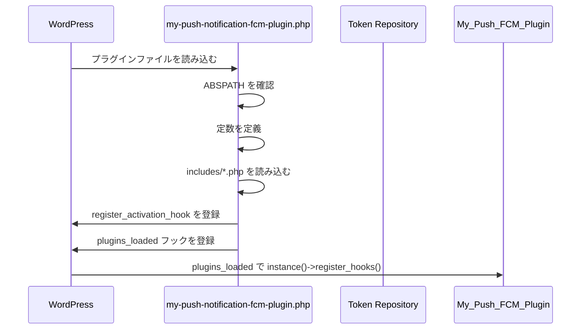

### 削減判断

ここは削れません。WordPress プラグインとして動かすための土台です。

## 3.2 データベース管理

### 目的

通知先となる FCM 登録トークンを WordPress DB に保存し、送信時に取り出せるようにします。

### 担当ファイル

- `includes/class-my-push-fcm-token-repository.php`

### 主な責務

- トークン保存テーブル名を決める
- 有効化時にテーブルを作成する
- FCM トークンを新規登録または更新する
- 有効なトークン一覧を取得する
- 無効なトークンを `inactive` にする
- 管理画面表示用に有効トークン数を返す

### テーブル

`{$wpdb->prefix}my_push_fcm_tokens`

| カラム | 内容 |
| --- | --- |
| `id` | 主キー |
| `token_hash` | FCM トークンの SHA-256 ハッシュ。重複判定に使用 |
| `token` | FCM 登録トークン本文。送信時に使用 |
| `platform` | `android` / `ios` / `web` / `unknown` |
| `app_id` | アプリ識別子 |
| `user_id` | WordPress ユーザー ID。未ログイン時は NULL |
| `device_label` | 端末表示名 |
| `status` | `active` / `inactive` |
| `created_at` | 作成日時 |
| `updated_at` | 更新日時 |

### テーブル作成シーケンス

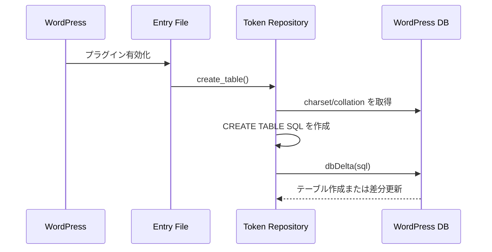

### トークン保存シーケンス

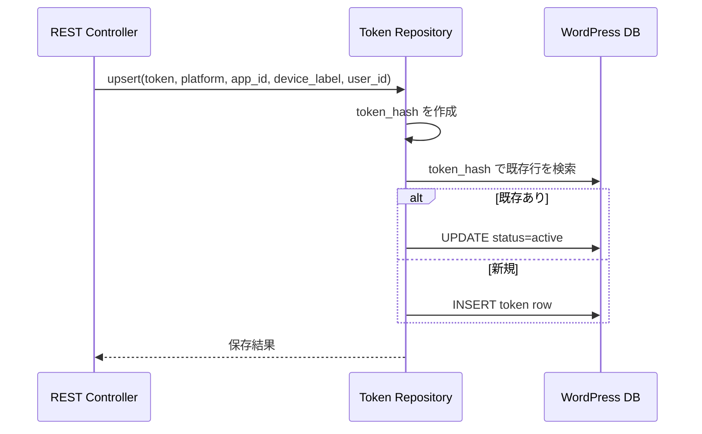

### 削減判断

複数端末や無効トークン管理をするなら必要です。

削減する場合は、DB テーブルではなく `option` にトークン配列を保存する案があります。ただし、次の機能は弱くなります。

- 大量トークン管理
- 端末ごとの無効化
- 重複判定
- 管理画面での件数表示
- 将来のユーザー別配信

## 3.3 FCM トークン登録受付

### 目的

Flutter アプリやブラウザーから FCM 登録トークンを受け取り、WordPress 側の通知先リストに追加します。

### 担当ファイル

- `includes/class-my-push-fcm-rest.php`
- `assets/js/fcm-config.js` はブラウザー用の補助

### 主な責務

- REST API ルートを登録する
- `/register` で FCM トークンを保存する
- `/unregister` で FCM トークンを無効化する
- `/web-config` で Web 用 VAPID 公開鍵を返す
- nonce を検証する
- 登録 API に簡易レート制限をかける
- 入力値を sanitize する

### REST API

| Method | Route | 内容 |
| --- | --- | --- |
| `GET` | `/wp-json/my-push-fcm/v1/web-config` | Web 用 VAPID 公開鍵を返す |
| `POST` | `/wp-json/my-push-fcm/v1/register` | FCM 登録トークンを保存する |
| `POST` | `/wp-json/my-push-fcm/v1/unregister` | FCM 登録トークンを無効化する |

### 登録シーケンス

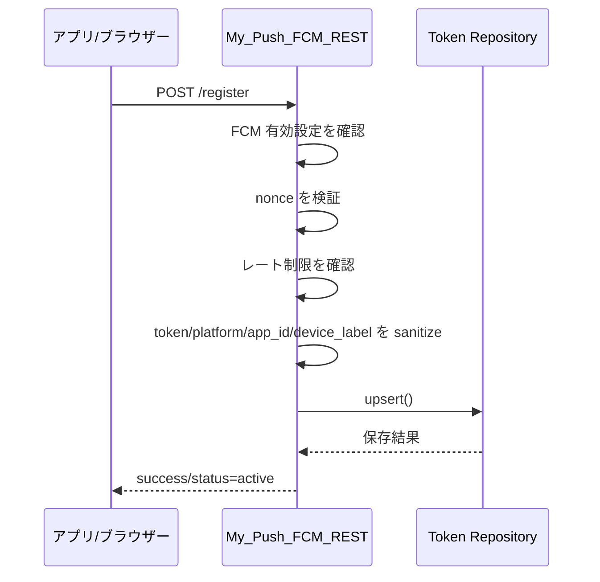

### 解除シーケンス

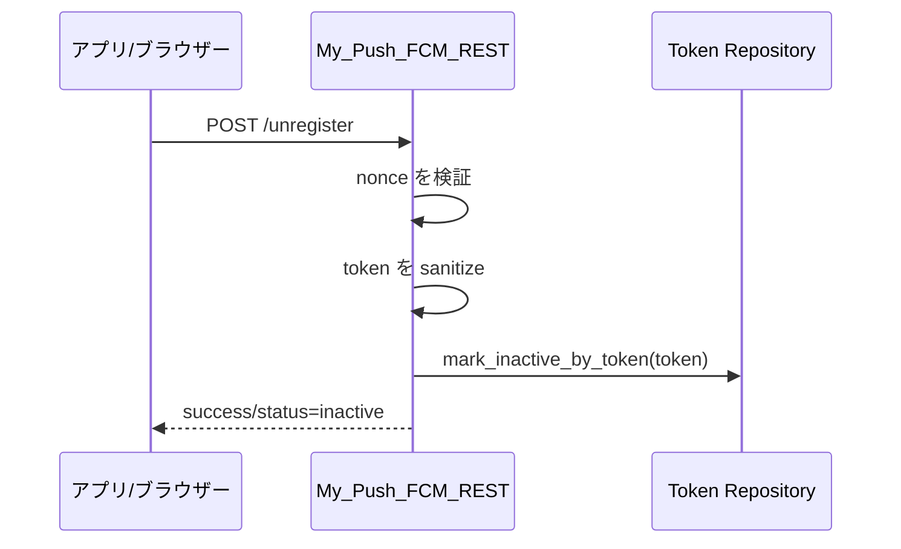

### Web 設定取得シーケンス

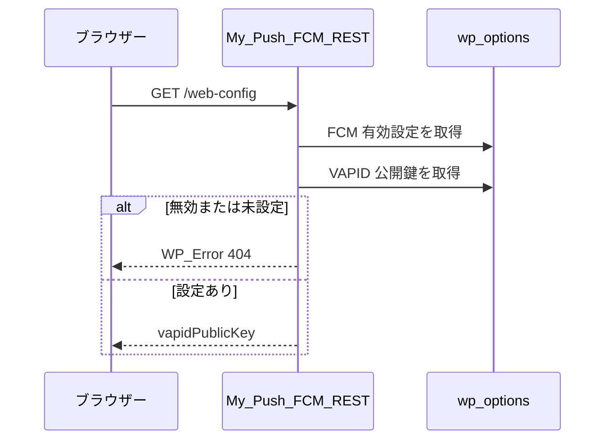

### 削減判断

Flutter アプリから WordPress にトークン登録するなら `/register` と `/unregister` は必要です。

ブラウザー通知を扱わないなら、次は削れます。

- `/web-config`
- `assets/js/fcm-config.js`
- `my_push_fcm_web_vapid_public`

## 3.4 Firebase 認証

### 目的

FCM HTTP v1 API を呼ぶため、Firebase サービスアカウント JSON から Google OAuth2 アクセストークンを取得します。

### 担当ファイル

- `includes/class-my-push-fcm-oauth.php`

### 主な責務

- 保存済みサービスアカウント JSON を読み込む
- `client_email` / `private_key` / `token_uri` を検証する
- JWT header / claims を作成する
- 秘密鍵で RS256 署名する
- Google OAuth2 token endpoint へ POST する
- アクセストークンをキャッシュする
- 認証エラー時にキャッシュを破棄する

### Option

| Option | 内容 |
| --- | --- |
| `my_push_fcm_service_account` | Firebase サービスアカウント JSON |
| `my_push_fcm_oauth_cache` | アクセストークンと有効期限 |

### シーケンス

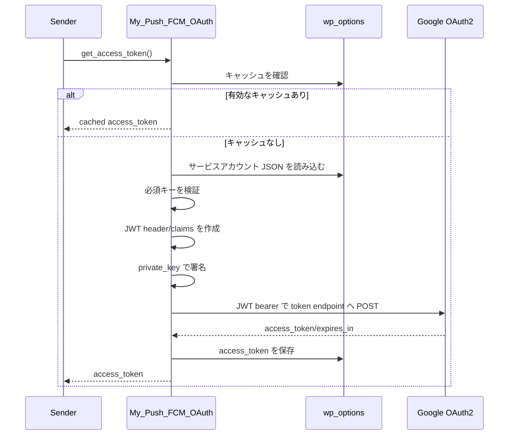

### 削減判断

FCM HTTP v1 API を使うなら、ほぼ削れません。

削るには次のような前提変更が必要です。

- 別サーバーで FCM 送信を行い、WordPress は通知依頼だけ投げる
- Firebase Admin SDK を使える別の実行環境に寄せる
- レガシー API を使う。ただし現在の設計方針としては非推奨

## 3.5 通知送信

### 目的

保存済みの有効 FCM トークンへ、FCM HTTP v1 API を使って通知を送信します。

### 担当ファイル

- `includes/class-my-push-fcm-sender.php`

### 主な責務

- FCM 送信設定がそろっているか確認する
- テスト通知の payload を作成する
- 通知 payload を FCM HTTP v1 形式へ変換する
- 有効トークン一覧を取得する
- 各トークンに対して FCM API を呼ぶ
- 成功数と失敗数を集計する
- 無効トークンを `inactive` にする
- 401 エラー時に OAuth キャッシュを破棄する

### シーケンス

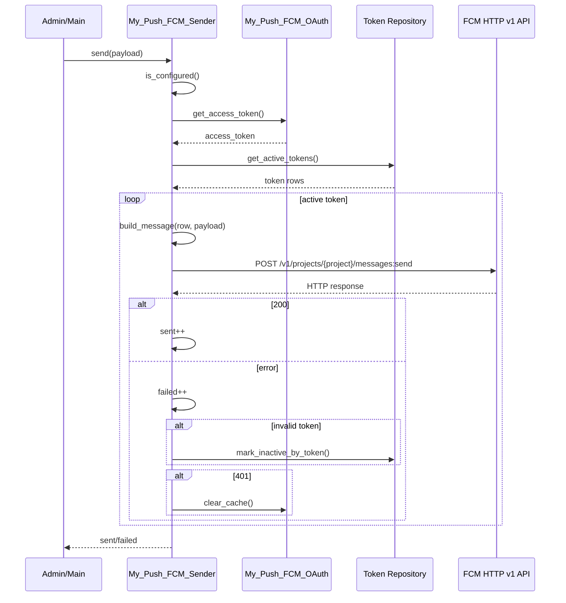

### 削減判断

通知を送る本体なので必要です。

削れる可能性があるのは次の補助処理です。

- APNs / Android / WebPush の細かな platform 別指定
- 無効トークン判定の詳細パース
- 送信件数の詳細集計

ただし、削ると運用時の失敗検知やトークン掃除が弱くなります。

## 3.6 管理画面

### 目的

WordPress 管理者がブラウザー上で FCM 設定、状態確認、テスト送信をできるようにします。

### 担当ファイル

- `includes/class-my-push-fcm-admin.php`

### 主な責務

- 設定メニューを追加する
- Settings API に option を登録する
- チェックボックス値を `1` / `0` に正規化する
- サービスアカウント JSON を検証する
- サービスアカウント変更時に OAuth キャッシュを破棄する
- 有効トークン数と OpenSSL 状態を表示する
- テスト通知を送信する
- テスト結果を transient で表示する

### Option

| Option | 内容 |
| --- | --- |
| `my_push_fcm_enabled` | FCM 配信の有効/無効 |
| `my_push_fcm_project_id` | Firebase project ID |
| `my_push_fcm_service_account` | Firebase サービスアカウント JSON |
| `my_push_fcm_web_vapid_public` | Web Push 用 VAPID 公開鍵 |
| `my_push_fcm_default_title` | 通知タイトル初期値 |
| `my_push_fcm_auto_notify_posts` | 投稿公開時の自動通知有効/無効 |

### 設定保存シーケンス

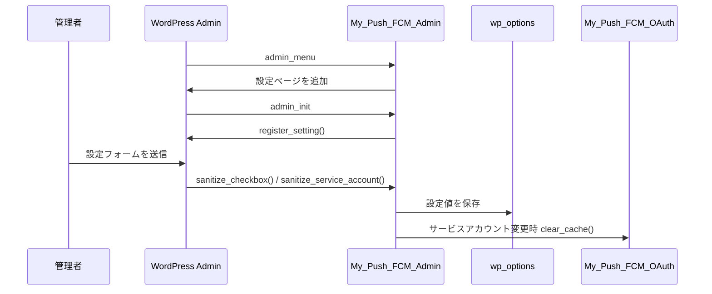

### テスト通知シーケンス

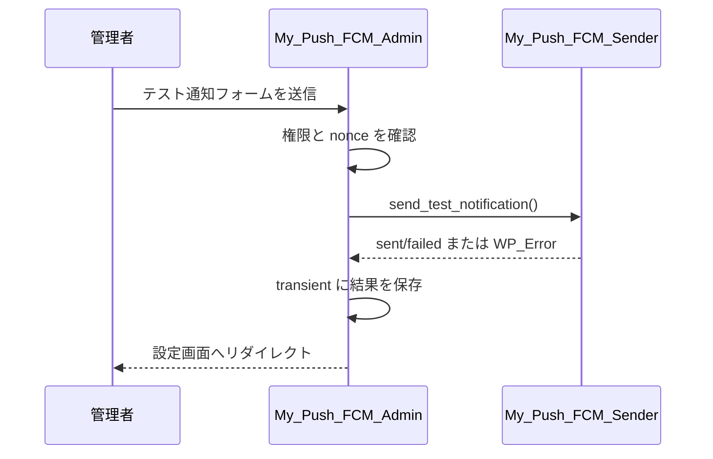

### 削減判断

最小実装にするなら削減候補です。

管理画面を削る場合は、設定値を次のどちらかで持つ必要があります。

- `wp-config.php` の定数
- PHP ファイル内の固定値

ただし、管理画面を削ると次ができなくなります。

- 管理者による設定変更
- テスト通知
- 有効トークン数確認
- OpenSSL 状態確認
- サービスアカウント JSON の入力検証

## 3.7 WordPress イベント連携

### 目的

WordPress 側の出来事をきっかけに通知を送信します。現在は投稿の新規公開が対象です。

### 担当ファイル

- `includes/class-my-push-fcm-plugin.php`

### 主な責務

- `transition_post_status` を監視する
- 新規 publish かどうか判定する
- 投稿タイプが `post` か確認する
- 自動通知設定が有効か確認する
- 通知タイトル、本文、URL、アイコンを作る
- `My_Push_FCM_Sender::send()` を呼び出す

### シーケンス

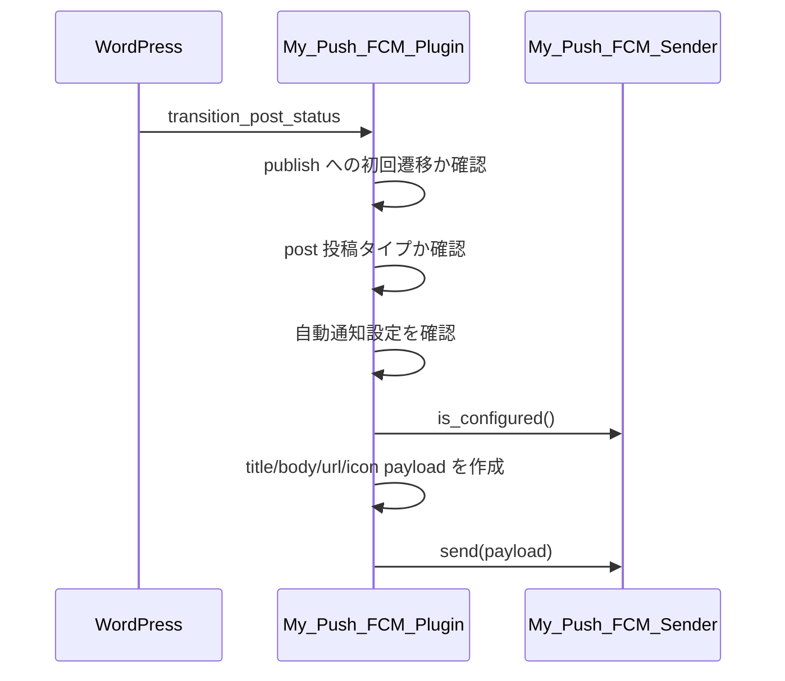

### 削減判断

投稿公開時の自動通知が不要なら削れます。

削る場合は次を削減できます。

- `transition_post_status` フック
- `maybe_send_post_notification()`
- `my_push_fcm_auto_notify_posts`
- 投稿通知用の設定 UI

## 3.8 アンインストール

### 目的

プラグイン削除時に、保存した DB テーブルと設定値を削除します。

### 担当ファイル

- `uninstall.php`

### 主な責務

- `WP_UNINSTALL_PLUGIN` を確認する
- FCM トークン保存テーブルを削除する
- FCM 関連 option を削除する
- OAuth キャッシュを削除する

### シーケンス

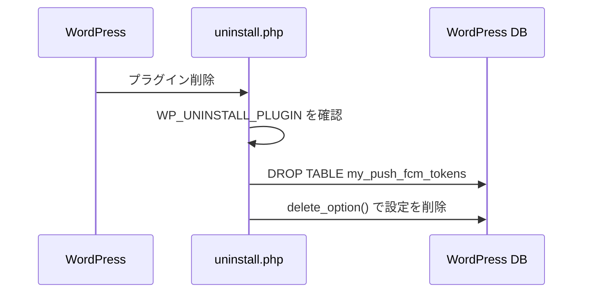

### 削減判断

必須ではありませんが、残す方が安全です。削るとプラグイン削除後も DB テーブルや設定値が残ります。

## 4. エンドツーエンドの代表フロー

## 4.1 初回セットアップ

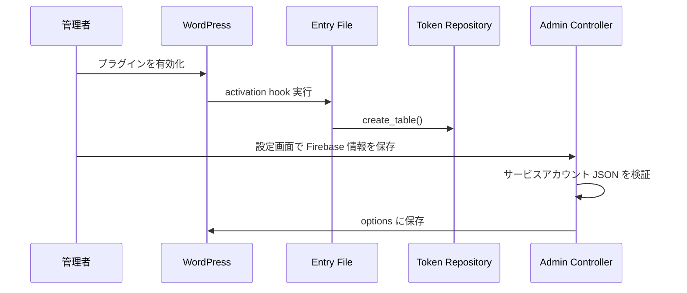

## 4.2 アプリ端末を通知対象に追加する

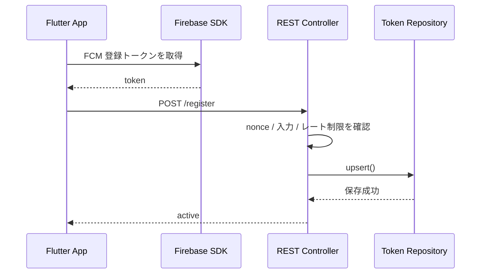

## 4.3 投稿公開から通知送信まで

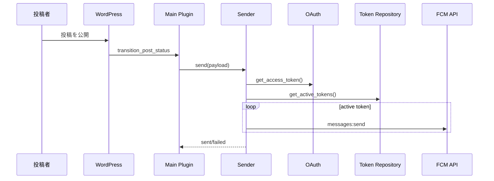

## 5. 縮小検討

## 5.1 削りやすい順

| 優先 | 削減候補 | 理由 | 影響 |
| --- | --- | --- | --- |
| 1 | `bin/check-fcm-flow.sh` | 開発確認用で本体ではない | 手動確認スクリプトがなくなる |
| 2 | `assets/js/fcm-config.js` | ブラウザー通知補助 | Flutter 専用なら影響小 |
| 3 | `/web-config` | Web VAPID 公開鍵配布 | ブラウザー通知をしないなら不要 |
| 4 | 投稿公開時自動通知 | 通知トリガーの 1 つ | 手動送信や別トリガー前提なら不要 |
| 5 | 管理画面 | 便利機能 | 設定をコードや定数で持つ必要あり |
| 6 | DB テーブル | トークン管理基盤 | 複数端末管理が弱くなる |
| 7 | OAuth | FCM HTTP v1 認証 | 基本的に削減非推奨 |
| 8 | Sender | 通知送信本体 | 削れない |

## 5.2 Flutter アプリ専用の最小構成案

ブラウザー通知と管理画面を省き、Flutter アプリからトークン登録し、WordPress から送信する最小寄り構成です。

| ファイル | 残す理由 |
| --- | --- |
| `my-push-notification-fcm-plugin.php` | プラグイン入口として必要 |
| `includes/class-my-push-fcm-plugin.php` | 起動とフック登録の調停に必要 |
| `includes/class-my-push-fcm-token-repository.php` | 複数端末のトークン保存に必要 |
| `includes/class-my-push-fcm-rest.php` | Flutter アプリからトークン登録するなら必要 |
| `includes/class-my-push-fcm-oauth.php` | FCM HTTP v1 の認証に必要 |
| `includes/class-my-push-fcm-sender.php` | 通知送信に必要 |
| `uninstall.php` | 保存データを削除するなら必要 |

削れる可能性が高いもの。

- `includes/class-my-push-fcm-admin.php`
- `assets/js/fcm-config.js`
- `/web-config`
- `my_push_fcm_web_vapid_public`
- 投稿公開時自動通知
- `bin/check-fcm-flow.sh`

## 6. 利用している WordPress フック一覧

このプラグインで登録している WordPress のフック (アクション / フィルター / 専用フック) と、フック発火時に行う処理の対応表です。

| 種別 | フック名 | フックの役割 (一般) | 本プラグインでの処理 | ソース | 公式リファレンス |
| --- | --- | --- | --- | --- | --- |
| activation | `register_activation_hook( __FILE__, ... )` | プラグインが「有効化」されたときに 1 回だけ呼ばれる特殊フック。テーブル作成や初期 option 設定など、初期セットアップで使う。 | プラグイン有効化時に `My_Push_FCM_Token_Repository::create_table()` を呼び出し、FCM トークン保存テーブルを `dbDelta()` で作成 / 差分更新 | [my-push-notification-fcm-plugin.php:70-75](../my-push-notification-fcm-plugin.php#L70-L75) | [register_activation_hook](https://developer.wordpress.org/reference/functions/register_activation_hook/) |
| action | `plugins_loaded` | すべてのアクティブなプラグインが読み込まれた直後に発火。プラグイン同士の依存関係が解決済みなので、フック登録の起点としてよく使われる。 | 全プラグインの読み込み完了後に `My_Push_FCM_Plugin::instance()->register_hooks()` を呼び、本プラグインのフック登録を開始 | [my-push-notification-fcm-plugin.php:80-85](../my-push-notification-fcm-plugin.php#L80-L85) | [plugins_loaded](https://developer.wordpress.org/reference/hooks/plugins_loaded/) |
| action | `init` | WordPress がリクエスト処理を開始した直後、ユーザー認証後に発火する汎用初期化フック。CPT・タクソノミー・翻訳の登録などに使う。 | `load_textdomain()` を呼び出し、`languages/` 配下の翻訳ファイル (.mo) を読み込み | [includes/class-my-push-fcm-plugin.php:94](../includes/class-my-push-fcm-plugin.php#L94) | [init](https://developer.wordpress.org/reference/hooks/init/) |
| action | `wp_enqueue_scripts` | フロントエンド (非管理画面) で CSS / JS をエンキューするためのフック。テーマやプラグインがブラウザ向けアセットを正しく出力する標準入口。 | 非管理画面かつ FCM 有効時に `assets/js/fcm-config.js` を登録し、`wp_localize_script()` で `MyPushFCM` グローバル (nonce、`/web-config` `/register` `/unregister` の REST URL) をフロントエンドへ渡す | [includes/class-my-push-fcm-plugin.php:95](../includes/class-my-push-fcm-plugin.php#L95), [enqueue_frontend_assets()](../includes/class-my-push-fcm-plugin.php#L116-L145) | [wp_enqueue_scripts](https://developer.wordpress.org/reference/hooks/wp_enqueue_scripts/) |
| action | `transition_post_status` (priority 10 / 3 引数) | 投稿ステータスが変化したとき (下書き → 公開、公開 → ゴミ箱 など) に発火。`($new_status, $old_status, $post)` を受け取り、公開トリガー処理に向く。 | 投稿ステータス変化を監視し、`publish` への新規遷移かつ `post` タイプかつ自動通知 ON かつ FCM 設定済みの場合に、設定タイトル / 投稿タイトル / パーマリンク / サイトアイコンを payload にして `My_Push_FCM_Sender::send()` を呼ぶ | [includes/class-my-push-fcm-plugin.php:96](../includes/class-my-push-fcm-plugin.php#L96), [maybe_send_post_notification()](../includes/class-my-push-fcm-plugin.php#L167-L199) | [transition_post_status](https://developer.wordpress.org/reference/hooks/transition_post_status/) |
| action | `admin_menu` | 管理画面のメニュー / サブメニューを追加するための専用フック。`add_menu_page()` / `add_options_page()` 等はこのタイミングで呼ぶ必要がある。 | `add_options_page()` で「設定」配下に「Push 通知 (FCM)」設定ページを追加 (`manage_options` 権限) | [includes/class-my-push-fcm-admin.php:41](../includes/class-my-push-fcm-admin.php#L41), [add_settings_page()](../includes/class-my-push-fcm-admin.php#L61-L69) | [admin_menu](https://developer.wordpress.org/reference/hooks/admin_menu/) |
| action | `admin_init` | 管理画面のあらゆるリクエスト処理開始時に発火。Settings API での `register_setting()` や、管理画面限定の権限チェック / リダイレクトなどに使う。 | Settings API で `my_push_fcm_enabled` / `my_push_fcm_project_id` / `my_push_fcm_web_vapid_public` / `my_push_fcm_service_account` / `my_push_fcm_default_title` / `my_push_fcm_auto_notify_posts` を `register_setting()` し、各々サニタイズコールバックを設定 | [includes/class-my-push-fcm-admin.php:42](../includes/class-my-push-fcm-admin.php#L42), [register_settings()](../includes/class-my-push-fcm-admin.php#L74-L147) | [admin_init](https://developer.wordpress.org/reference/hooks/admin_init/) |
| action | `admin_post_my_push_fcm_send_test` | `admin-post.php` に POST / GET された任意アクションを処理する動的フック (`admin_post_{action}`)。管理画面のフォーム送信を独自エンドポイントとして受ける標準パターン。 | 管理画面のテスト送信フォーム POST を受け、`manage_options` 権限と nonce を検証したうえで `My_Push_FCM_Sender::send_test_notification()` を実行し結果を transient に保存 | [includes/class-my-push-fcm-admin.php:43](../includes/class-my-push-fcm-admin.php#L43), [handle_test_notification()](../includes/class-my-push-fcm-admin.php#L189) | [admin_post_{action}](https://developer.wordpress.org/reference/hooks/admin_post_action/) |
| filter | `plugin_action_links_{basename}` | プラグイン一覧画面で各プラグイン行に表示される操作リンク (Activate / Deactivate / Edit など) を、プラグインごとに加工できる動的フィルター。 | プラグイン一覧画面の操作リンクの先頭に「設定」リンクを差し込む (`add_action_links()`) | [includes/class-my-push-fcm-admin.php:44](../includes/class-my-push-fcm-admin.php#L44), [add_action_links()](../includes/class-my-push-fcm-admin.php#L50-L56) | [plugin_action_links_{plugin_file}](https://developer.wordpress.org/reference/hooks/plugin_action_links_plugin_file/) |
| filter | `pre_update_option_my_push_fcm_service_account` | 特定 option 更新の直前に値を加工 / 検証 / 中断できる動的フィルター。`($value, $old_value, $option)` を受け取り、戻り値が DB に保存される値となる。 | サービスアカウント JSON は機密かつサイズ大のため、値が変わる場合のみ `update_option(..., false)` を呼んで `autoload=no` で保存し直す | [includes/class-my-push-fcm-admin.php:136-146](../includes/class-my-push-fcm-admin.php#L136-L146) | [pre_update_option_{option}](https://developer.wordpress.org/reference/hooks/pre_update_option_option/) |
| action | `rest_api_init` | REST API サーバーが初期化されるときに発火。`register_rest_route()` で独自エンドポイントを登録するための標準フック。 | 名前空間 `my-push-fcm/v1` に 3 ルートを `register_rest_route()` で登録 (`GET /web-config` / `POST /register` / `POST /unregister`) | [includes/class-my-push-fcm-rest.php:32](../includes/class-my-push-fcm-rest.php#L32), [register_routes()](../includes/class-my-push-fcm-rest.php#L38-L75) | [rest_api_init](https://developer.wordpress.org/reference/hooks/rest_api_init/) |

補足

- `uninstall.php` は `register_uninstall_hook()` を使わず、WordPress がプラグイン削除時に直接実行するファイル規約に従う方式です。`WP_UNINSTALL_PLUGIN` 定数を確認したうえで、トークンテーブルの `DROP TABLE` と FCM 関連 option / OAuth キャッシュの `delete_option()` を行います。参考: [Uninstall Methods](https://developer.wordpress.org/plugins/plugin-basics/uninstall-methods/)
- `add_settings_error()` (`sanitize_service_account()` 内) はフックではなく Settings API 由来の通知関数です。参考: [add_settings_error()](https://developer.wordpress.org/reference/functions/add_settings_error/)

## 7. 次の判断ポイント

小さくする前に、次を決めると設計がかなり整理できます。

1. 通知対象は Flutter アプリだけか、ブラウザーも含むか
2. Firebase 設定は管理画面から入れるか、コードや定数で固定するか
3. 通知トリガーは投稿公開時か、手動か、外部 API からの依頼か
4. トークンは複数端末・複数ユーザーを管理するか、単純な全体配信だけか
5. プラグイン削除時にデータを完全削除するか、残すか
